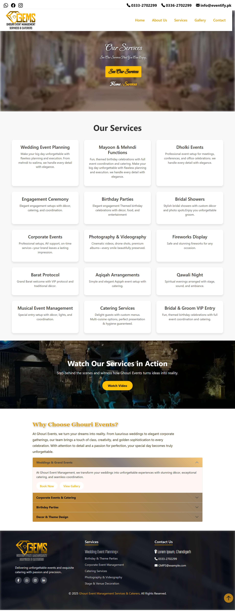

# 💎 GEMS — Ghouri Event Management Services & Caterers

Welcome to **GEMS**, a professionally designed website created for a real client in the event management industry. This project showcases my frontend development skills using **HTML**, **CSS**, **Vanilla JavaScript**, and **Bootstrap 5**.

---

## 📌 About the Project

This website was developed for **Ghouri Event Management Services & Caterers**, a company with over 25 years of experience in creating unforgettable events like weddings, corporate gatherings, and private parties.

The site includes multiple responsive pages and sections, each tailored to reflect the brand’s elegant identity and professionalism.

---

## 🛠️ Technologies Used

- ✅ HTML5  
- ✅ CSS3  
- ✅ Bootstrap 5  
- ✅ JavaScript (Vanilla JS)

---

## 📂 Website Structure

| Page | Description |
|------|-------------|
| `Home` | Main landing section with banner and intro |
| `About` | Company background and values |
| `Services` | List of services including weddings, parties, and corporate events |
| `Gallery` | Photo gallery with visual snapshots |
| `Contact Us` | Form for client inquiries and contact details |

---

## 🎥 Project Demo

Here’s a video demonstrating the website in action:  
📽️ [Watch Demo Video](https://drive.google.com/file/d/1LkvA5T8bnPx_uqpV6DjwdA3FGgGIDv9w/view?usp=drive_link) <!-- Replace this with actual video link -->

---

## 🖼️ Snapshots

| Home Page | About Page | Services Page |
|----------|-------------|---------------|
|  |  |  |

| Gallery Page | Contact Us |
|--------------|------------|
|  |  |

---

## 📦 How to Run Locally

1. Clone the repository  
2. Open the folder in your code editor (VS Code recommended)  
3. Open `index.html` in your browser  
4. Explore all pages from the navigation bar

---

## 📧 Contact

For any inquiries or feedback, feel free to contact me:  
**Name:** Kanzul Iman  
**Email:** kanzuliman2k21@gmail.com  
**GitHub:** [github.com/kanzul-iman](https://github.com/kanzul-iman)

---

> 💡 *This website was built as a real client project and demonstrates the practical use of frontend technologies.*
> 
